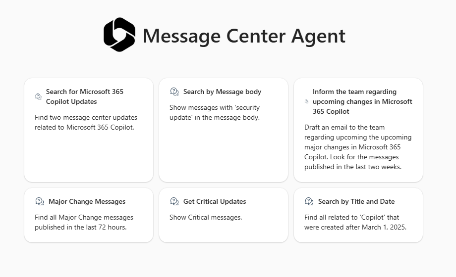
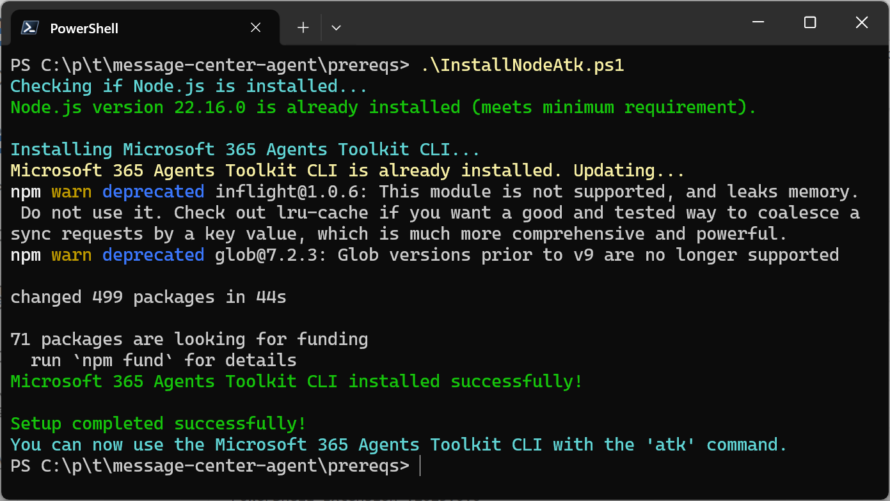
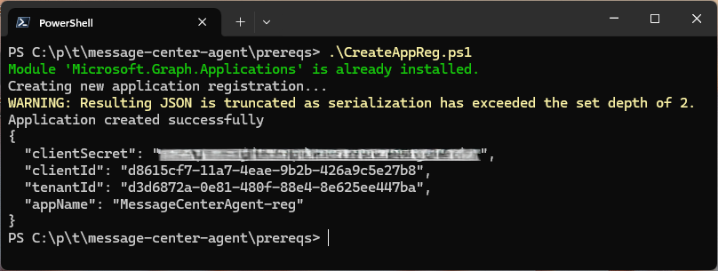
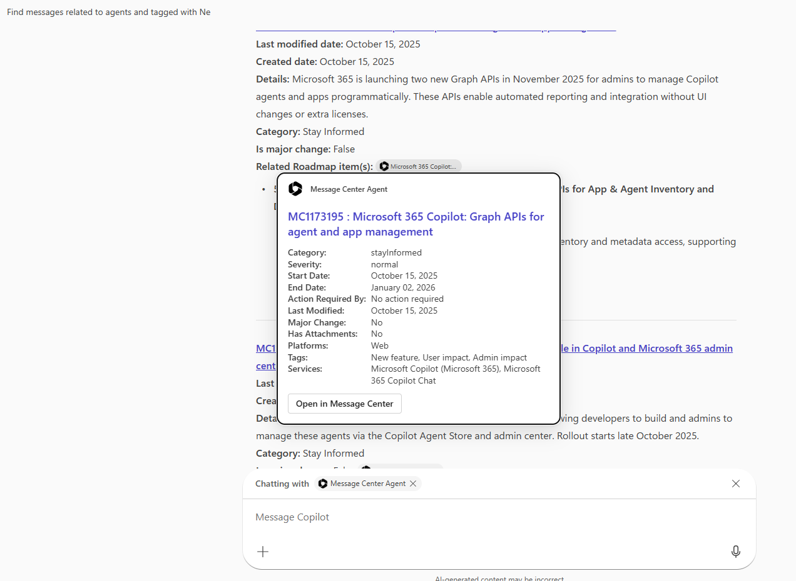
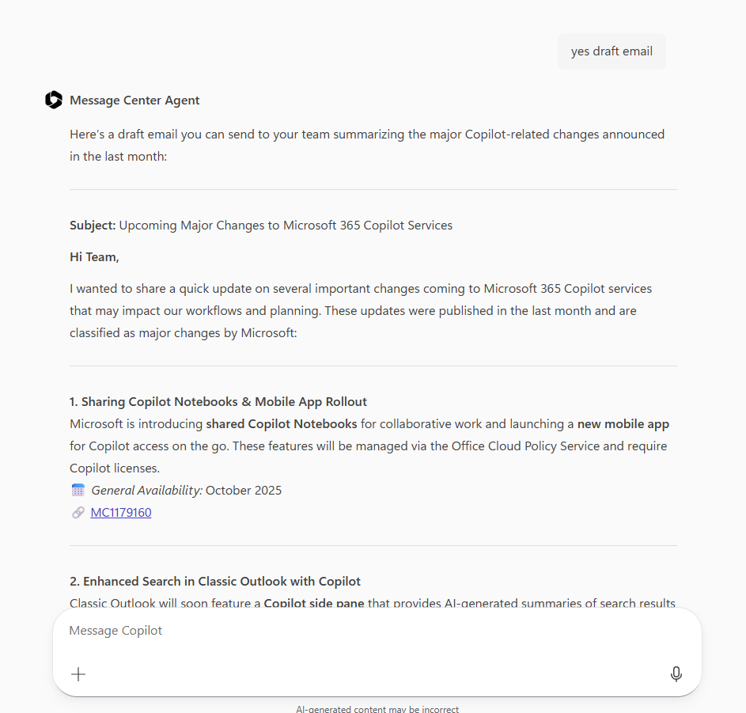
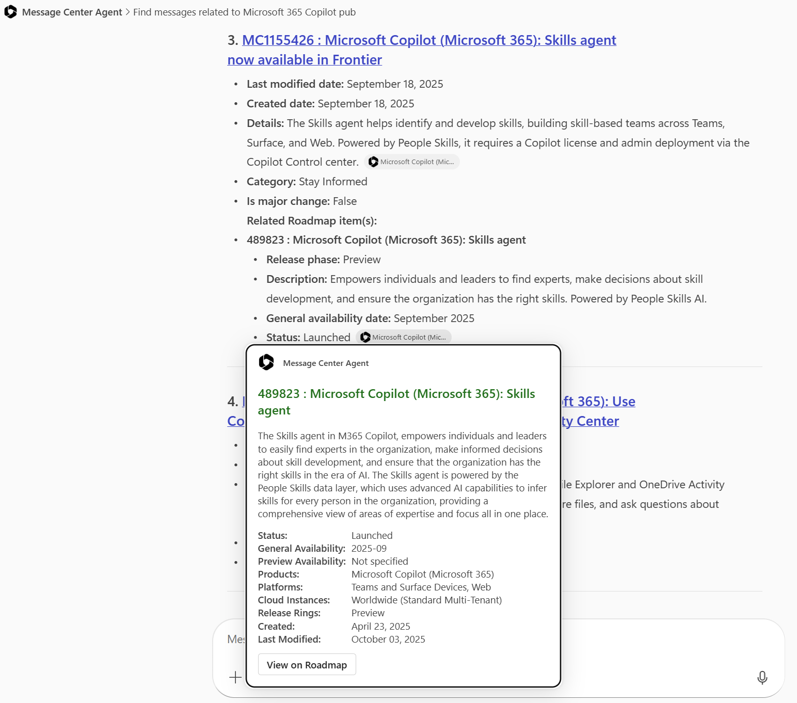

# Microsoft 365 Copilot: Message Center Agent

## Overview

 The M365 Copilot Message Center Agent allows you to search the **Microsoft 365 Admin Center** messages with Copilot chat using natural language prompts. Includes details regarding related features in the Microsoft 365 Roadmap. 
  


## M365 Message Center Agent Use Cases

Not only can admins and 'Message Center Readers' search for messages, but you can also use the power of generative AI to summarize them and draft internal communications. Here are some examples of what you can do:

- **Search for messages**: Find specific messages in the Microsoft 365 Admin Center message center. Search by keywords, date ranges, and message types. Search is case-insensitive. Search by message Title (default) or message body.
- **Summarize messages**: Get a summary of the latest messages in the message center.
- **Draft internal communications**: Generate draft emails or messages to share information about updates with your team.
- **Get insights**: Gain insights regarding impact of updates for your organization.
- **Get alternatives** Get suggested alternatives for deprecated features.
- **Get suggested actions**: Get suggested actions for updates that require your attention.
- **Roadmap Detail Included**: Results include related Microsoft 365 Roadmap details to provide additional context about upcoming features and changes.  
  
| [Deployment Guide](#deployment-guide) | [Modification Guide](#modification-guide) | [Suggested Scenarios and Prompts](./suggested_prompts/suggested_prompts.md) |
| ------------------------------------- | ----------------------------------------- |----------------------------------------- |

# [Deployment Guide](#deployment-guide)

This guide provides step-by-step instructions to deploy the M365 Copilot Message Center Agent using the Microsoft 365 Agents Toolkit (ATK) CLI. In this guide you will create an Entra application registration, register it with the Teams Developer Portal (provision the agent), and upload it for private testing or submit it your Teams administrator for distribution to your entire organization. After provisioning, the agent will be available in the Copilot chat interface for you to use.

## Prerequisites

1. See the [Required Roles](#required-roles) section below for the roles required to deploy the agent. 
2. Custom App Uploading must be enabled in your Microsoft 365 tenant via the Teams Admin Center. See section [Enable Custom App Uploading](#enable-custom-app-uploading) below for more information on enabling custom app uploading.

Steps to deploy the M365 Copilot Message Center Agent using the Microsoft 365 Agents Toolkit (ATK) CLI:

1. Clone this repository 

2. Install the [Microsoft 365 Agents Toolkit CLI](#install-microsoft-365-agents-toolkit-cli) and NodeJS using the PowerShell script provided in the `prereqs` folder.
   
   1. Open a PowerShell terminal
   2. Set the Script Execution Policy to allow running scripts. You can do this by running the following command:
      ```powershell
      Set-ExecutionPolicy Unrestricted -Scope CurrentUser
      ```
      This command allows you to run scripts in your current user context. You may need to confirm the change by typing 'Y' and pressing Enter.

   3. Change to the `prereqs` folder and run `InstallNodeAtk.ps1`. The output should be similar to this:
      

>[!WARNING]
>Note: The ATK works with any [LTS version of Node](https://nodejs.org/en/about/previous-releases) >= v20. It does not work and generates errors with non-LTS version 25.2.1.

3. Register an application with Entra (Azure AD) to enable OAuth2.0 authentication and API access.
   
   1. In the `prereqs` folder, run the following command to register the application:
      
      ```bash
      .\CreateAppReg.ps1 
      ```
      
      This will create an Entra app registration with the name **MessageCenterAgent-reg**. It will also output the **Application (client) ID** and **Client Secret**. You will need these values later in the deployment process. 
      

#### [Microsoft 365 Tenant Requirements](#microsoft-365-tenant-requirements)
To deploy the M365 Copilot Message Center Agent, you need the following requirements in your Microsoft 365 tenant:

- **Microsoft 365 Tenant with a M365 Copilot license and admin access**. See ['Required roles'](#required-roles) below. You can use a test tenant available in your organization, if available. Alternatively, you can  use a Microsoft 365 sandbox subscription with a Copilot license. See [here](https://learn.microsoft.com/en-us/microsoft-365-copilot/extensibility/prerequisites#copilot-development-environment) for information on obtaining a Microsoft 365 developer sandbox subscription with a Copilot license.
 
- **Custom app uploading** must be enabled in your Microsoft 365 tenant via the Teams Admin Center. This is required for the M365 Agents Toolkit to sideload the agent to M365 Copilot. See [here](https://learn.microsoft.com/en-us/microsoftteams/teams-custom-app-policies-and-settings#allow-users-to-upload-custom-apps) for more information on enabling custom app uploading.

## Provisioning the Agent for testing and demos

You're now ready to deploy the M365 Copilot Message Center Agent using the Microsoft 365 Agents Toolkit (ATK) CLI.

1. Start a new PowerShell terminal and change to the root folder of the cloned repository.
1. In the root folder of the repository, run the following command to deploy the agent:
   
   ```bash
   atk provision --env production
   ```
   
   Input the **Client Id** and **Client Secret** obtained from the previous step when prompted. The `--env production` flag indicates that you are deploying the agent to production.

   Type 'Y' when the script pauses to inform you: 'Microsoft 365 Agents Toolkit uploads the client id/secret for OAuth Registration to Developer Portal'.
   This will provision the agent in your Microsoft 365 tenant and register it with the Teams Developer Portal. The output should be similar to this:
   

## Test the Agent
Test the agent by starting Copilot in the web or app and selecting the Message Center agent. Note that the agent is private to you for testing purposes. See the **Publish** step below to submit the agent to the Teams admin for distribution to the organization.


## Publish the Agent (Optional)
If you want to make the agent available to your entire organization, you can publish it to the Copilot agents store. This step is optional and is only needed if you want to share the agent with others in your organization.

To **publish** the agent to your organization, you can submit it to your Teams administrator for distribution by running the following command:
   
   ```bash
   atk publish --env production
   ```

   This will upload the agent to your Microsoft 365 tenant and make it available in the Copilot agents store after the Teams administrator approves it.

# [Modification Guide](#modification-guide)

If you want to modify the M365 Copilot Message Center Agent, you can do so by following the steps in this section. 

## Prerequisites

1. See the [Required Roles](#required-roles) section below for the roles required to deploy the agent. 

2. See the [Microsoft 365 Tenant Requirements](#microsoft-365-tenant-requirements) section above for the requirements in your Microsoft 365 tenant.

3. Install the [Microsoft 365 Agents Toolkit ](https://marketplace.visualstudio.com/items?itemName=TeamsDevApp.ms-teams-vscode-extension) extension for Visual Studio Code.

4. Register an application with Entra (Azure AD) to enable OAuth2.0 authentication and API access.
   
   1. In the `prereqs` folder, run the following command to register the application:
      
      ```bash
      .\CreateAppReg.ps1 
      ```
      This will create an Entra app registration with the name **MessageCenterAgent-reg**. It will also output the **Application (client) ID** and **Client Secret**. You will need these values later in the deployment process. 
      

### Provision the Agent using the Microsoft 365 Agents Toolkit

The M365 Agents Toolkit for Visual Studio Code streamlines app registration and deployment to Microsoft Teams. It automates OAuth2.0 setup, securely manages client credentials, and eliminates the need to handle infrastructure, letting you focus on app development.

1. Rename the file `.env.production.sample` to `.env.production` in the `env` folder of the project. This file will be populated with environment variables for the project for production release, including the client ID and OAuth2 authentication id.
1. Using the M365 Agents Toolkit, in the LIFECYCLE section, select 'Provision'.
3. Provide the client id, and client secret obtained when running the app registration script. Note that the M365 Agents Toolkit will register the app in the Teams Developer Portal and update the OAUTH2_REGISTRATION_ID variable in your .env file with the value received from the Teams Developer Portal.

## Use the Message Center Agent in Copilot

The 'Provision' step deploys the agent privately to you for testing purposes. Start Copilot chat in the app or web and select 'Message Center Agent'.

## Publish the Agent (Optional)
If you want to make the agent available to your entire organization, you can publish it to the Copilot agents store. This step is optional and is only needed if you want to share the agent with others in your organization.

1. Using the M365 Agents Toolkit, in the LIFECYCLE section, select 'Publish to Organization'.

## Architecture   
### Zero Code
   
   The declarative agent is built using the Microsoft M365 Agents Toolkit for Visual Studio Code. It leverages the Microsoft Graph API to interact with the Microsoft 365 Admin Center and retrieve messages. Authentication is handled using OAuth2.0, and the agent is designed to work seamlessly with Microsoft 365 Copilot. The declarative agent is a zero-code solution, meaning you don't need to write any code to set it up or use it. The agent is designed to be easy to setup and requires no coding experience.


### Authentication and Graph API Permissions

The implementation of the authentication leverages the M365 Teams app authentication infrastructure that takes care of the OAuth2.0 flow and token management for you. See here: [Configure authentication for API plugins in agents](https://learn.microsoft.com/en-us/microsoft-365-copilot/extensibility/api-plugin-authentication). Additionally, the Agents Toolkit for Visual Studio Code is used to provision the app registration and deploy the app to Microsoft Teams. This eliminates the need for direct Microsoft 365 registration  using the [Teams Developer portal](https://dev.teams.microsoft.com/) and allows you to focus on building your app inside Visual Studio Code.

To support OAuth2.0 authentication, requires the following step:

1. Microsoft Entra App Registration
2. Provision the app using the M365 Agents Toolkit. 

Details of these steps are provided below.

### Microsoft Entra App Registration

To use the declarative agent, you need to register your app in the Entra portal and configure the necessary permissions. This app registration will be registered on the Teams Developer Portal. The app registration is required to authenticate users and authorize access to the Microsoft Graph API and Microsoft 365 Admin Center. The Teams developer portal provides a secure environment for managing your app's authentication settings and permissions. 


### Starter Prompts

Here are some prompts to get you started with the Message Center Agent:

`Find all message center updates related to Microsoft 365 Copilot created in the last 30 days.`

`Show me all messages with 'security update' in the message body.`

`Show all critical messages`

`Find all messages with 'Copilot' in the title that were created after March 1, 2025 that are Major Change messages.`

`Draft an email informing the team about Microsoft Teams updates that are 'Plan for Change' messages published in the last month.`

`Find messages tagged as User impact with Copilot in the title published after April 4`

> Possible (Case sensitive) tag values: Updated message, New feature, User impact, Admin impact, Retirement

### Example Output

  
Agents started with an @mention in Copilot chat. The results of the search can be passed to other agents or activities in Copilot chat.

  
Here we are drafting an email to inform the team about major changes coming to M365 Copilot. Email is drafted in follow up prompt.  

Here's an example of output with M365 Roadmap details included:  


### Key Files

The following files are key to the implementation of the declarative agent:

- **openapi.json**: This file contains the OpenAPI specification for the Graph API ['https://graph.microsoft.com/v1.0/admin/serviceAnnouncement/messages'](https://learn.microsoft.com/en-us/graph/api/serviceannouncement-list-messages?view=graph-rest-1.0&tabs=http) that the declarative agent will use to search and retrieve messages from the Microsoft 365 Admin Center. 

> NOTE: This file was generated using the following prompt in GitHub Copilot using model GPT 4.5:

>Extract the openapi definition for the graph API /admin/serviceAnnouncement/messages from https://raw.githubusercontent.com/microsoftgraph/msgraph-metadata/refs/heads/master/openapi/v1.0/openapi.yaml. Covert YAML output to JSON.

- **roadmap-openapi.json**: This file contains the OpenAPI specification for the Microsoft 365 Roadmap V2 API [https://www.microsoft.com/releasecommunications/api/v2/m365](https://www.microsoft.com/releasecommunications/api/v2/m365) that the declarative agent will use to search and retrieve roadmap items from the Microsoft 365 Roadmap.  
- **declarativeCopilot.json**: This file contains the declarative agent configuration that defines the behavior and capabilities of the agent. No capabilities have been defined for this agent.
- **manifest.json**: This file contains the Teams application manifest that defines metadata for the declarative agent. This is what is displayed in the Copilot agents store.
- **m365agents.yml**: This file contains the M365 Agents Toolkit project configuration, including the OAuth2 registration and other settings.
- **.env.production**: This file contains environment variables for the project for production release, including the client ID and secret for OAuth2 authentication.

## [Required Roles](#required-roles)

## Required Roles - App Registration

To create an app registration in Microsoft Entra (Azure AD), you must have one of the following roles:

* Global Administrator
* Application Administrator
* Cloud Application Administrator

The recommended least-privileged role specifically for creating and managing app registrations is **Application Administrator**.

- **Global Administrator**: Required to grant admin consent for the app registration and API permissions.

## Required Roles - Agent Provisioning

The roles required to manage the Teams app (Agent) in Microsoft 365 and deploy it to the organization are:

* Teams Administrator: Required to manage and deploy Teams apps within the organization via the Teams Admin Center.
* Global Administrator: Can also manage and deploy Teams apps, but has broader permissions beyond Teams management.

The recommended least-privileged role specifically for managing and deploying Teams apps is **Teams Administrator**.

## Required Roles - Teams Developer Portal

Note that this step is done via the M365 Agents Toolkit's 'Provision' feature. To register your app in the Teams Developer Portal, you must have one of the following roles:

* **Teams Administrator**: Required to manage and deploy Teams apps within the organization via the Teams Admin Center.
* **Global Administrator**: Can also manage and deploy Teams apps, but has broader permissions beyond Teams management.

The recommended least-privileged role specifically for managing and deploying Teams apps is **Teams Administrator**.
Note: This role is required when using the M365 Agents Toolkit to provision the app registration and deploy the app.

## Required Roles - Agent Usage

To read Microsoft 365 Message Center messages, and therefor use this agent, a user must have one of the following Microsoft 365 admin roles:

* **Message Center Reader**
* **Global Reader**
* **Service Support Administrator**
* **Service Administrator**
* **Global Administrator**

The recommended least-privileged role specifically for reading Message Center messages is **Message Center Reader**.

## Troubleshooting
If you encounter issues during deployment or usage of the M365 Copilot Message Center Agent, consider the following troubleshooting steps:
1. **Display the underlying Graph API call:** Note that you can inspect the OData URL generated by the agent with the prompt ***'Show me the URL for this query***' to help with troubleshooting. This displays the OData Graph API query. The output will look something like this:
   ![Screenshot of OData URL output showing the Microsoft Graph API query generated by the Message Center Agent. The URL reads: https://graph.microsoft.com/v1.0/admin/serviceAnnouncement/messages?$orderby=lastModifiedDateTime desc&$count=true&$top=5&$filter=tags/any(t: t eq 'User impact') and services/any(s: contains(s, 'Copilot')) and startDateTime ge 2025-10-21T00:00:00Z. The URL is displayed in a code block format against a light background, demonstrating the technical query structure used to retrieve Microsoft 365 admin center messages with specific filtering criteria for user impact tags, Copilot services, and date ranges.](./Images/GraphAPICall.png)
This information should help you identify any issues with the query parameters or filters being used and assist in refining your prompts.

1. If a prompt is not returning expected results, try refining the prompt or breaking it down into smaller parts to isolate the issue.
2. **Check Permissions**: Ensure that the app registration has the necessary API permissions granted and admin consented.
3. **Review Logs**: Check the logs in the M365 Agents Toolkit for any error messages that can provide insights into the issue.
4. **Validate Environment Variables**: Ensure that the environment variables in the `.env.production` file are correctly set, including the client ID and secret.
5. **Consult Documentation**: Refer to the official Microsoft documentation for the M365 Agents Toolkit and Microsoft Graph API for additional guidance.
6. Open an issue in this repository for further assistance.

## More Agents
For an agent that searches only the Microsoft 365 Roadmap and does not require authentication, see the [M365 Roadmap Agent](https://github.com/mjfusa/m365-roadmap-agent). 
