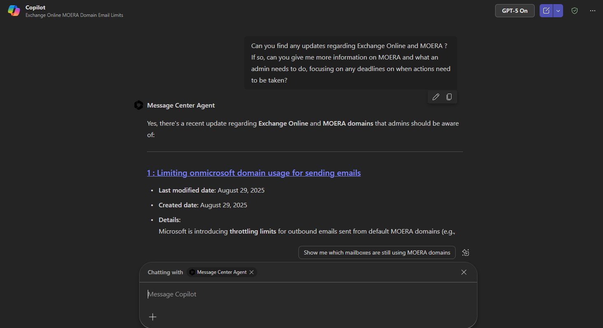
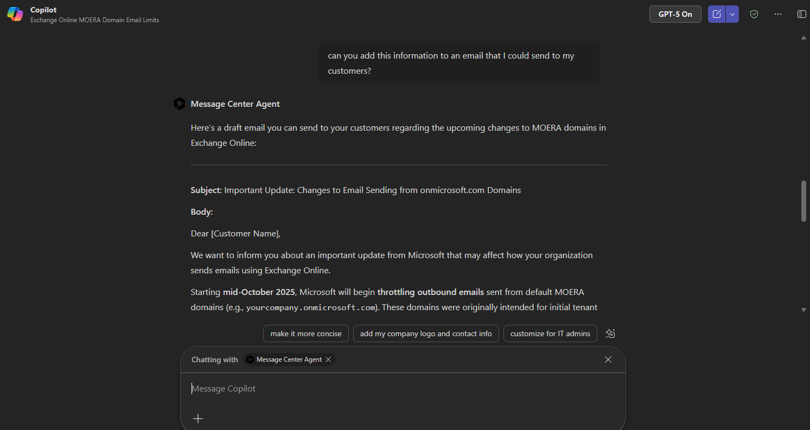
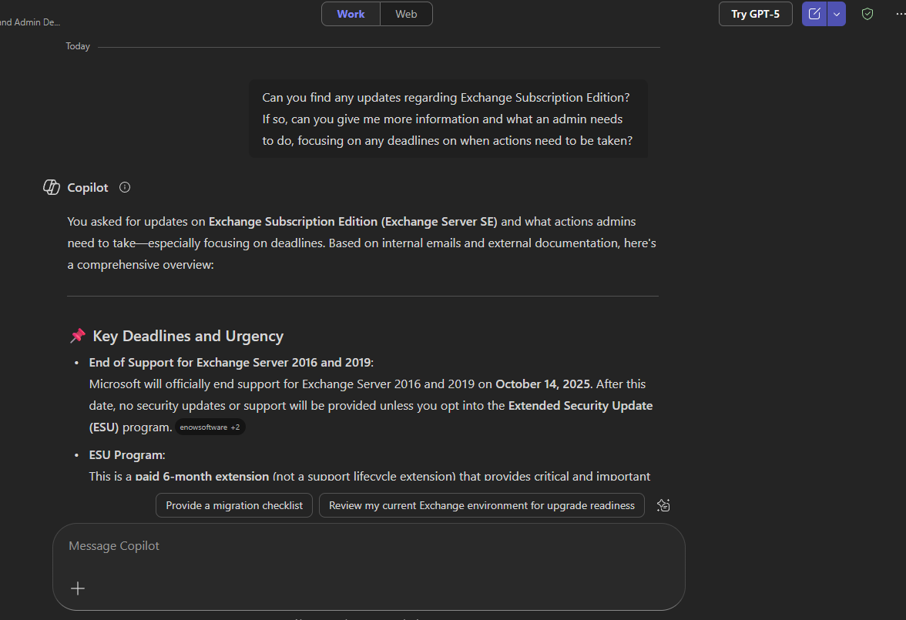
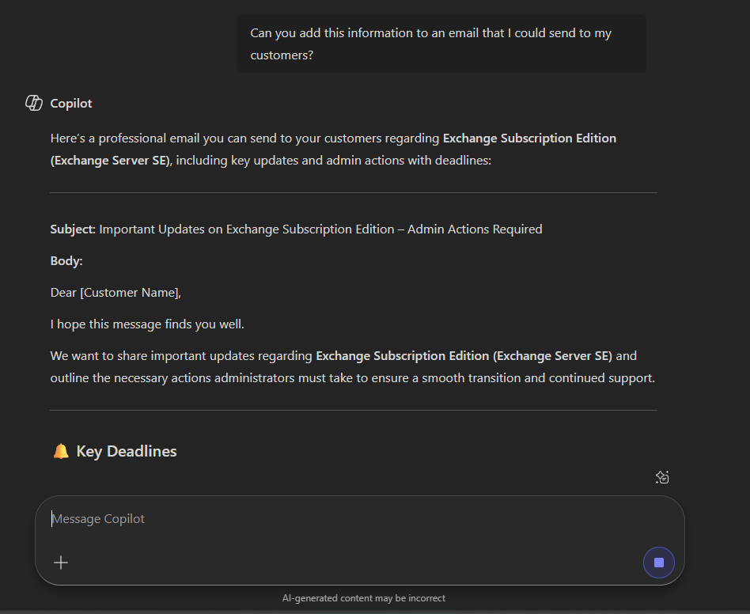

# Create customer facing M365 Technology and Feature Update Emails 

## Scenario

An IT Admin, Customer Support Professional or Relationship Manager would like to create an email that would outline any urgent message center posts that call out actions that need to be performed by a certain deadline. This would help customers stay aware of such actions and not miss important deadlines which may include config changes that might impact their user community.

## Methodology

This process uses the Message Center Agent and Copilot’s generative AI capability to search for the most relevant updates depending on the requested prompt then creates an email that would allow the admins you work with to see the latest MC Posts per technology or topic; listing out an overall explanation, any admin actions that should be performed, as well as any deadlines that these actions should be performed by with dates included.  This process combines the Message Center Agent and Copilot Chat’s ability to create an email based on the agent’s output. Once the CSA has the output, they could copy this to Outlook and send the update to their customers. This process could be added to a weekly or biweekly rotation which would enhance the customer’s or admin’s visibility on Message Center Posts.

## Instructions

1. Start in Copilot Chat

2. @ mention the Message Center Agent

3. Enter the following prompt:
> 1. Can you find any updates regarding %certain technology% and\or %certain feature% ? If so, can you give me more information on % technology or feature mentioned% and what an admin needs to do, focusing on any deadlines on when actions need to be taken?
>
> 2. Add this information to an email that I could send to my customers?

Examples:
1. Exchange Online and MOERA

2. Exchange Subscription Edition

## Author:

JT Thompson (jthompgh)