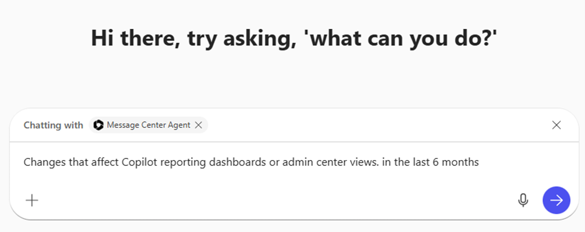
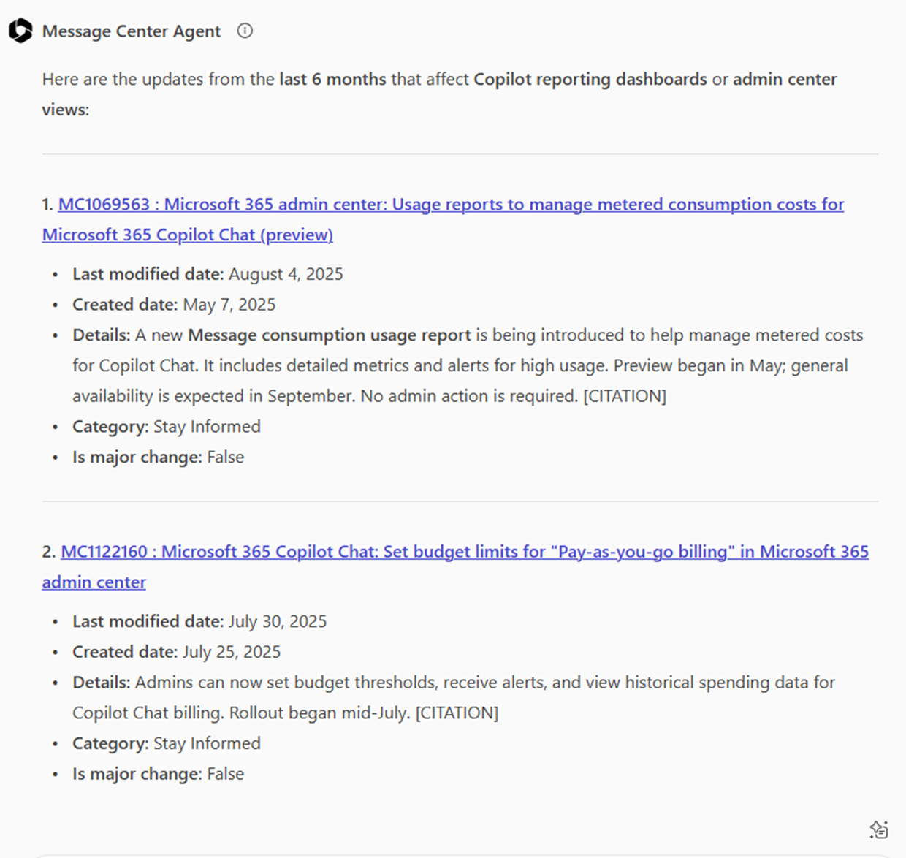
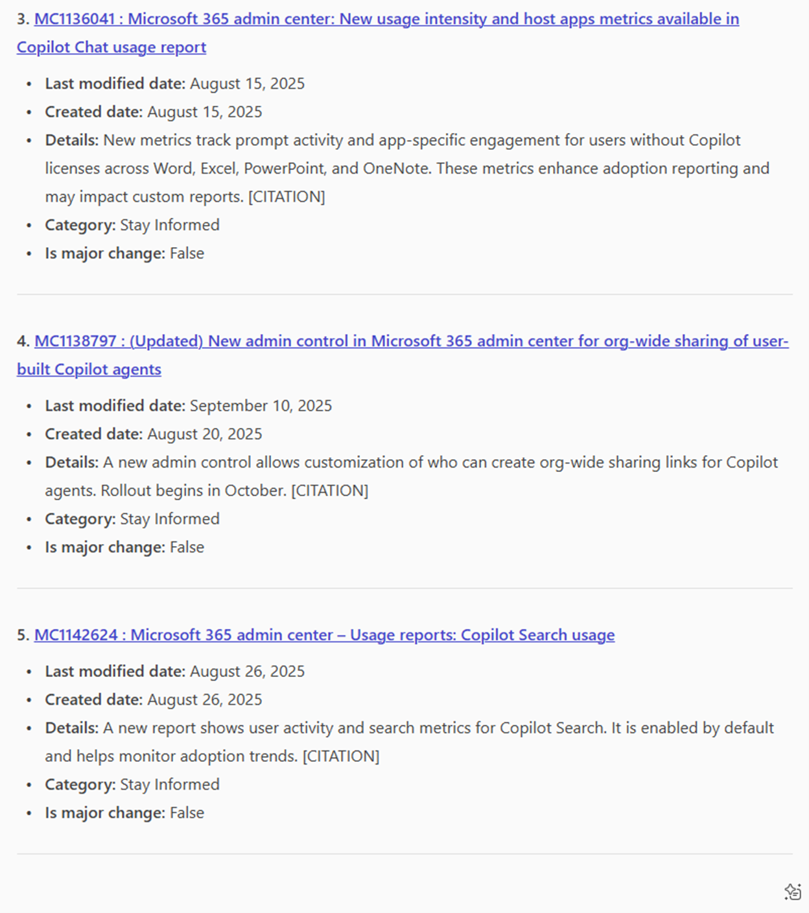
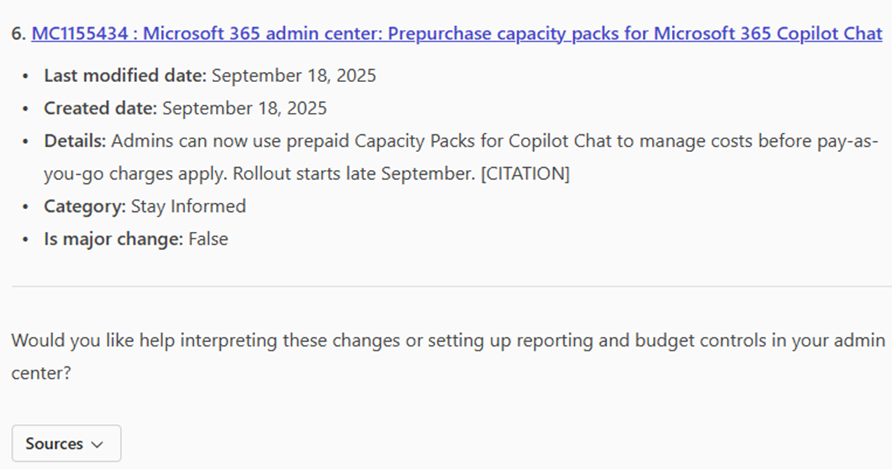
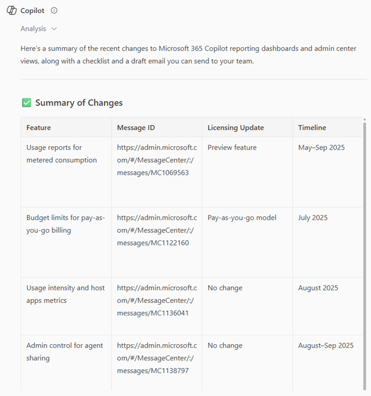
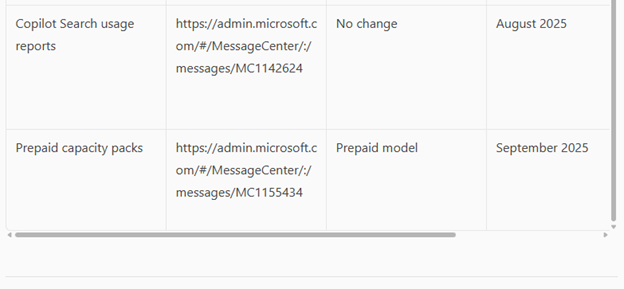
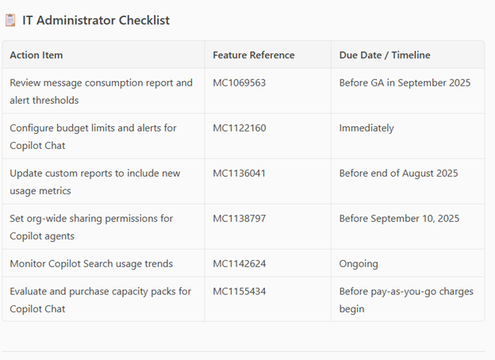
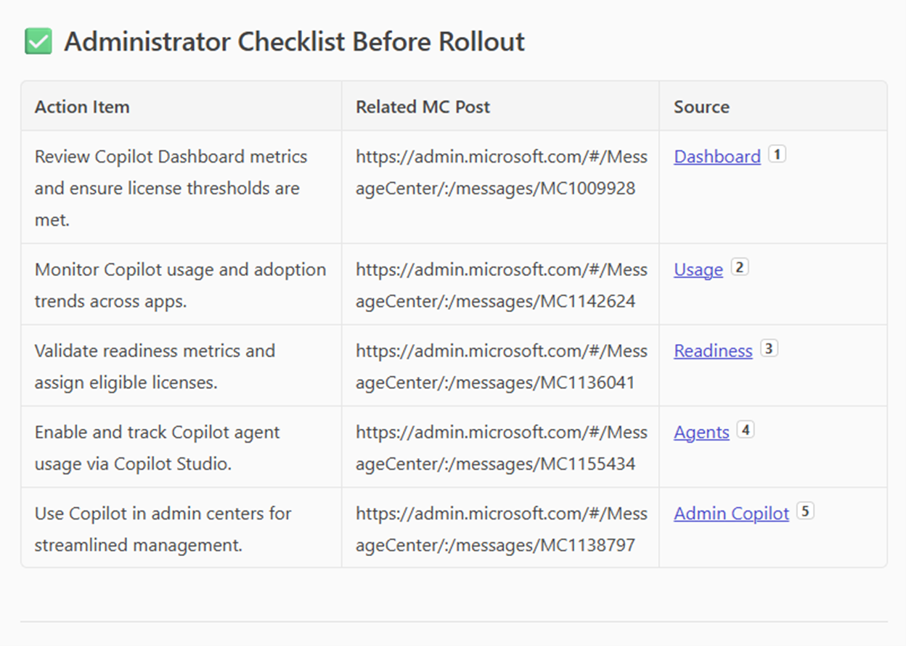
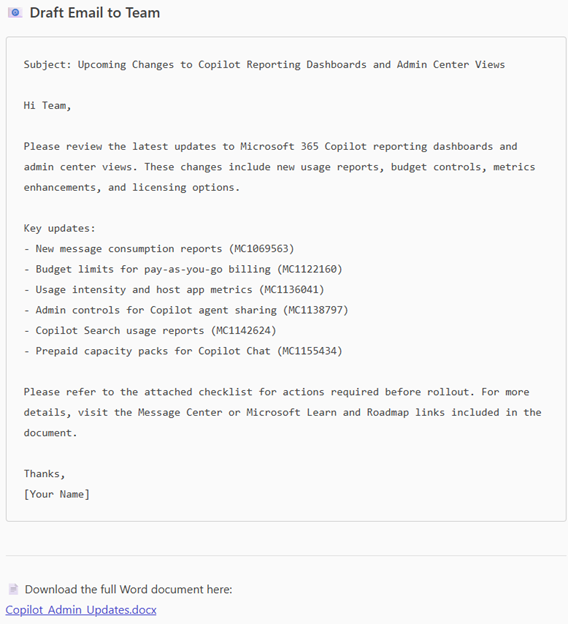

# Preparing for Changes to Copilot Reporting Dashboards and Admin Center Views

## Scenario
An IT administrator needs to update their team on upcoming changes to Copilot Reporting Dashboards and Admin Center Views. The admin will leverage the Message Center Agent in combination with Copilot Chat to draft an email to their team, along with an admin roll-out checklist based on the features published to the Microsoft Message Center. 

## Methodology
This process uses the Message Center Agent and Copilot’s generative AI capability to produce a team briefing for upcoming changes to Microsoft 365 Copilot and Copilot Chat. It combines the Message Center Agent and Copilot Chat’s ability to create a Word document based on the agent’s output.

## Instructions

1. Start in Copilot Chat
Open a new conversation in Copilot Chat.
2. @mention the Message Center Agent
3. Enter the following prompt

> Changes that affect copilot reporting dashboards or admin center views in the last six months.

The output at this point should look similar to the following:

   
4.	Exit Message Center Agent
5.	In Copilot Chat, enter the following prompt:

> I am an IT administrator. Please summarize these changes to Copilot reporting dashboards and Admin Center views based on the Message Center Agent output. Create a checklist of actions in table format that I need to take before the rollout. Please show the output and create a Word document with this information. Also, draft an email with this information that I can send to my team. Include the following:  
Feature changes with message IDs (with links)
Licensing update  
Timelines  
Source Attribution (Microsoft Learn, Microsoft 365 roadmap, or Tech Community) with link to the article or roadmap item.

Here’s the Output:

  

IT Administrator Checklist:  

    
Administrator Checklist Before Rollout:    

Draft Email to Team:    

Here is the example of the Summary document that was generated: [Copilot Admin Updates](./other/Copilot_Admin_Updates.docx).

Note:
This process is designed to help IT administrators and teams stay informed about recent changes to Copilot reporting dashboards or admin center views.

## Author
Mithra Ravichandran (rmithraa-create)

